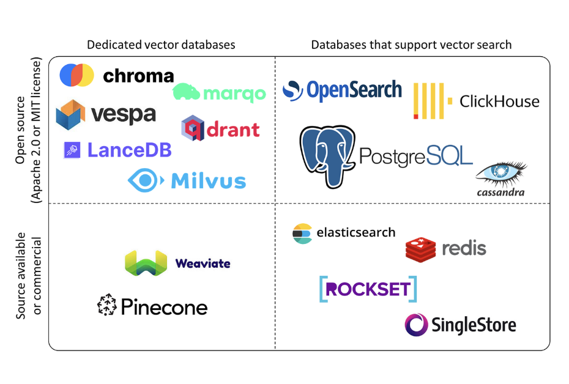

# Document Storage with Vector Databases

This module introduces **Document Storage** - storing documents in vector databases using embeddings for semantic search and retrieval in RAG (Retrieval-Augmented Generation) applications.

## What is Document Storage?

Document storage with vector databases enables:
- **Semantic Search**: Find documents by meaning, not just keywords
- **Efficient Retrieval**: Quickly find the most relevant documents
- **Scalability**: Handle large document collections
- **Persistence**: Store embeddings for future use

Vector databases are the third step in building RAG applications - after loading and splitting documents, you store them in a vector database for efficient retrieval.

## Concepts Covered

- **Embeddings**: Converting text to numerical vectors
- **Vector Databases**: Storing embeddings (Chroma)
- **Retrievers**: Searching vector databases for similar documents
- **Semantic Search**: Finding documents by meaning

## How Document Storage Works

Document storage follows this process:

1. **Load Documents**: Use document loaders to load files
2. **Split Documents**: Break large documents into chunks
3. **Create Embeddings**: Convert text chunks to vectors
4. **Store in Vector Database**: Save embeddings in Chroma

### Example Flow:
```
Documents → Split → Embed → Store in Vector DB
```

> **Note:** Creating retrievers and building retrieval chains is covered in **module 011 (LCEL Retrieval Chain)**.

## Prerequisites

This module builds on the concepts from **08-RAG-document-loader** and **09-RAG-document-splitter**. Make sure you've completed those modules first.

### Setting Up Your Environment

**Complete Setup Steps:**

1. **Create the `.env` file** using the Makefile:
   ```bash
   make setup
   ```
   This creates a `.env` file from `.env.example` (or creates a template if it doesn't exist).

2. **Optional: Edit the `.env` file** and add your OpenAI API key:
   ```
   OPENAI_API_KEY=your-actual-api-key-here
   ```
   > **Note:** If you don't set an API key, the example will use Hugging Face embeddings instead. OpenAI embeddings are recommended for best results.

3. **Set up virtual environment and install dependencies:**
   ```bash
   make install
   ```
   This creates a Python virtual environment and installs all required packages.

**Embedding Selection:**
- **If `OPENAI_API_KEY` is set**: Uses OpenAI's text-embedding-3-small model (recommended)
- **If `OPENAI_API_KEY` is not set**: Uses Hugging Face's sentence-transformers/all-MiniLM-L6-v2 model

**Alternative: Environment Variable**
```bash
export OPENAI_API_KEY="your-api-key-here"
```

> **Note:** The `.env` file is automatically loaded by the examples using `python-dotenv`. Make sure not to commit your `.env` file to version control!

## Installation

The Makefile automatically sets up a Python virtual environment and installs all dependencies. Simply run:

```bash
make install
```

This will:
1. Create a virtual environment (`venv/`) if it doesn't exist
2. Install/upgrade pip
3. Install all required dependencies from `requirements.txt`

> **Note:** The virtual environment is created automatically and all Makefile commands will use it. You don't need to activate it manually.

### Dependencies

The module requires:
- `langchain-core`: For core LangChain functionality
- `langchain-community`: For document loaders and Hugging Face embeddings
- `langchain-openai`: For OpenAI embeddings
- `langchain-chroma`: For Chroma vector database integration
- `chromadb`: The Chroma vector database
- `pypdf`: For PDF file loading (optional, for examples)
- `unstructured`: For HTML and other unstructured formats (optional, for examples)
- `sentence-transformers`: For Hugging Face embeddings (optional)
- `python-dotenv`: For environment variable management

All dependencies are listed in `requirements.txt` and installed automatically with `make install`.

### Manual Installation (Alternative)

If you prefer to set up manually:

```bash
# Create virtual environment
python3 -m venv venv

# Activate virtual environment
source venv/bin/activate  # On macOS/Linux
# or
venv\Scripts\activate  # On Windows

# Install dependencies
pip install -r requirements.txt
```

## Running the Examples

### Using Makefile (Recommended)

The Makefile automatically uses the virtual environment:

```bash
# Run the example (creates venv and installs deps if needed)
make run

# Test your knowledge with the quiz
make quiz

# Complete the coding challenge
make challenge

# Or run directly
make all
```

> **Note:** The first time you run any command, it will automatically set up the virtual environment and install dependencies if needed.

### Manual Execution

If you set up the environment manually, activate it first:

```bash
# Activate virtual environment
source venv/bin/activate  # On macOS/Linux

# Run example
python document_storage_example.py
```

## Understanding Document Storage Structure

Let's break down how document storage works:

```python
# Step 1: Load and split documents
from langchain_community.document_loaders import PyPDFLoader
from langchain_text_splitters import RecursiveCharacterTextSplitter

loader = PyPDFLoader("document.pdf")
documents = loader.load()
splitter = RecursiveCharacterTextSplitter(chunk_size=300, chunk_overlap=50)
split_docs = splitter.split_documents(documents)

# Step 2: Create embeddings
from langchain_openai import OpenAIEmbeddings
embedding_function = OpenAIEmbeddings(model="text-embedding-3-small")

# Step 3: Store in vector database
from langchain_chroma import Chroma
vectorstore = Chroma.from_documents(
    documents=split_docs,
    embedding=embedding_function,
    persist_directory="./chroma_db"
)

# Step 4: Create retriever
retriever = vectorstore.as_retriever(
    search_type="similarity",
    search_kwargs={"k": 3}
)

# Step 5: Query
results = retriever.get_relevant_documents("your query")
```

### Key Components:

1. **Embeddings**: Convert text to vectors
   - `OpenAIEmbeddings`: Uses OpenAI's embedding models
   - `HuggingFaceEmbeddings`: Uses Hugging Face sentence transformers
   - Embeddings capture semantic meaning

2. **Vector Database (Chroma)**: Stores embeddings
   - Lightweight and easy to use
   - Persists to disk for future use
   - Enables fast similarity search

### The Flow:

```
Document Chunks
  ↓
Embedding Function
  ↓
Vector Embeddings
  ↓
Chroma Vector Database
```

> **Note:** Retrievers and retrieval chains are covered in **module 011 (LCEL Retrieval Chain)**.

## Code Examples

### Document Storage Example (`document_storage_example.py`)

This example demonstrates:
- Loading documents from PDF files
- Splitting documents into chunks
- Creating embeddings (OpenAI or Hugging Face)
- Storing documents in Chroma vector database

**Key Features:**
- Complete workflow from loading to storage
- Supports both OpenAI and Hugging Face embeddings
- Shows vector database persistence
- Prepares documents for retrieval (covered in module 011)

## Key Concepts Explained

### Embeddings


**Embeddings** are numerical representations of text. Embedding models aim to capture the "meaning" of the text, and these numbers map the text's position in a high-dimensional, or vector space.

- **When documents are embedded and stored**, similar documents are located closer together in the vector space
- **When a RAG application receives a user input**, it will be embedded and used to query the database

Embeddings convert text into numerical vectors that capture semantic meaning:
```python
from langchain_openai import OpenAIEmbeddings

embedding_function = OpenAIEmbeddings(model="text-embedding-3-small")
# Converts "machine learning" → [0.123, -0.456, 0.789, ...]
```

Similar texts have similar vectors, enabling semantic search.

### Vector Database (Chroma)

**Vector stores** are databases specifically designed to store and retrieve high-dimensional vector data.

- **One example is using a vector database** to store our documents and make them available for retrieval
- **This requires embedding our text documents** to create vectors that capture the semantic meaning of the text
- **Then, a user query can be embedded** to retrieve the most similar documents from the database and insert them into the model prompt

**There are many Vector Databases in LangChain. When making a decision:**
- Consider whether an **open source solution is required**, which may be the case if high customizability is required
- Also, consider whether **the data can be stored on off-premises on third-party servers** - not all cases will permit this
- The **amount of storage and latency of retrieving results** is also a key consideration
- Sometimes a **lightweight in-memory database will be sufficient**, but others will require something more powerful



Chroma is a lightweight vector database:
```python
from langchain_chroma import Chroma

vectorstore = Chroma.from_documents(
    documents=split_docs,
    embedding=embedding_function,
    persist_directory="./chroma_db"
)
```

- Stores embeddings alongside document content
- Enables fast similarity search
- Persists to disk for future use


## Quiz

Test your understanding of document storage! Run:

```bash
make quiz
```

The quiz covers:
- Purpose of embeddings
- What vector databases do
- What Chroma is

## Challenge

Put your skills to the test! Complete the coding challenge:

```bash
make challenge
```

The challenge will ask you to:
- Create embeddings
- Store documents in a vector database
- Understand vector database concepts

## Next Steps

After completing this module, you'll be ready for:
- **011-lcel-retrival-chain**: Building retrieval chains with LCEL (next module)
- **012-RAG-python-markdown**: Advanced RAG techniques

## Troubleshooting

### Common Issues

1. **Import Errors**: Make sure you've run `make install` to install all dependencies
2. **Chroma Import Error**: Install with `pip install langchain-chroma chromadb`
3. **Embedding Errors**: Check your API key if using OpenAI, or ensure Hugging Face models are downloaded
4. **Database Errors**: Delete the `chroma_db` directory and recreate it
5. **Slow Embeddings**: Hugging Face embeddings are slower than OpenAI; consider using OpenAI for better performance

### Getting Help

If you encounter issues:
1. Check that all dependencies are installed: `make install`
2. Verify your `.env` file has the OpenAI API key if using OpenAI embeddings
3. Try running the example directly: `python document_storage_example.py`
4. Check the error messages for specific guidance
5. Delete the `chroma_db` directory and try again if database errors occur

## Summary

Document storage with vector databases enables you to:
- ✅ Convert documents to embeddings
- ✅ Store embeddings in a vector database
- ✅ Prepare documents for semantic search and retrieval
- ✅ Scale to large document collections
- ✅ Persist embeddings for future use

This is an essential step for building effective RAG applications! The next module (011) will show you how to create retrievers and build retrieval chains.

